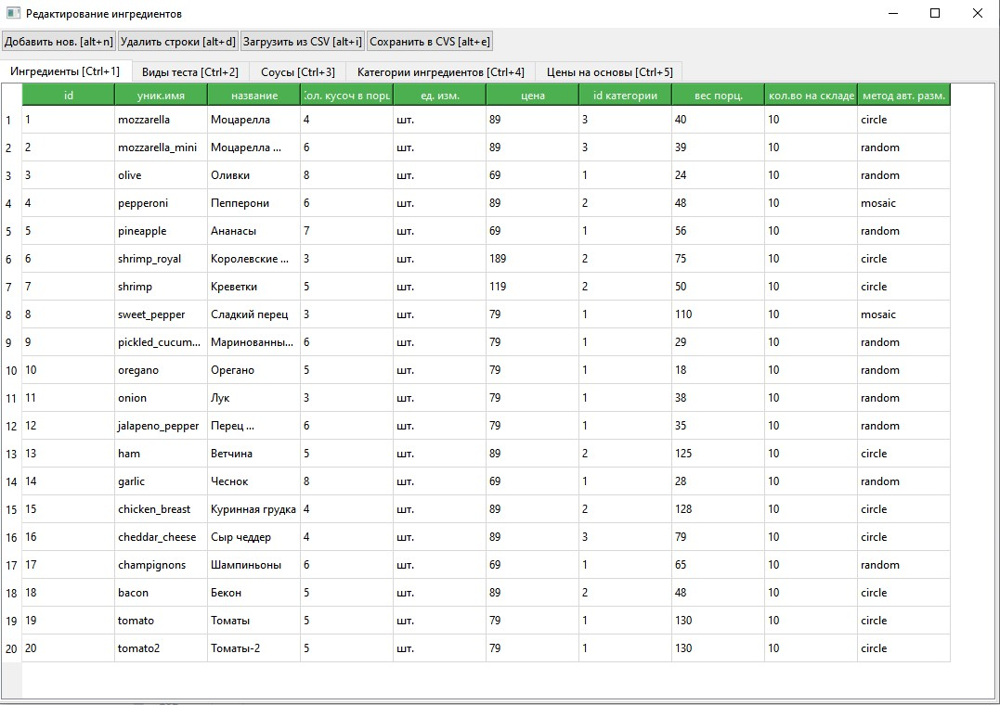

# Конструктор пиццы

Учебный проект яндекс лицей PyQt

## Общее описание

Приложение для терминала самообслуживания в пиццерии. Позволяет сделать заказ пиццы по индивидуальному заказу.

[Последние изменения](#последние-изменения)

### Составные части
* [Терминал самообслуживания (редактор пиццы, создание заказа)](#терминал-самообслуживания)
* [Интерфейс технолога (управление БД ингредиентов)](#интерфейс-технолога)
* Интерфейс работника кухни (просмотр и выполнение заказов)

## Терминал самообслуживания

### ТЗ 

* [Интерфейс пользователя (figma)](https://www.figma.com/design/GnL1HHSoZgVWraLhC70lMX/pizza_designer?node-id=0-1&t=3cG2pVHnpJpBUBtz-1)
* [Техническое задание (docs/tz_terminal.md)](docs/tz_terminal.md)
* [Скрины ТЗ](docs/screens.png)

### Процесс создания пиццы

Пользователю предлагается создать пиццу, для этого он сначала выбирает размер, основу и соус. Потом открывается редактор
пиццы. Есть возможность добавлять ингредиенты. У каждого ингредиента можно выбрать размер порции и по желанию разместить
его на пицце самостоятельно. После завершения создания пиццы нужно будет оплатить заказ. После чего статус заказа
изменится и его смогут увидеть повара на кухне.

### БД
* Ингредиенты, виды теста, виды соусов хранятся в БД (создаются при отсутствии автоматически).
  * таблицы: 
    * categories
    * ingredients
    * dough_types
    * souses
* Созданная пицца и заказ сохраняется в БД.
  * таблицы: 
    * pizzas
    * pizzas_ingredients
    * orders
* Базовые цены на основу + соус в зависимости от выбранного размера
  * таблица
    * base_price

Изображение пиццы экспортируется в папку `pizzas_pictures` при завершении заказа

### Структура

#### Файлы

* [pizza_project.py](pizza_project.py) - главный (запускаемый) файл проекта
* [terminal_main.py](screens/terminal_main.py) - главный файл для терминала самообслуживания
* [technolog_main.py](screens/technolog_main.py) - главный файл для экрана технолога
* [model.py](database/model.py) - классы модели данных
* [db.py](database/db.py) - функции работы с БД
* [payment_api.py](utils/payment_api.py) - платежный шлюз (эмуляция)
* [pizza_project.spec](pizza_project.spec) - настройки PyInstaller для экспорта проекта в [исполняемый файл](dist/pizza_project.zip)
* [requirements.txt](requirements.txt) - файл зависимостей

#### Папки

* [database](database) - папка содержит модули для работы с БД и моделями.
* [db_init](db_init) - SQL скрипты для создания БД и начального заполнения
* [docs](docs) - документация
* [images](images) - картинки проекта
* [pizzas_pictures](pizzas_pictures) - картинки пицц из заказов (будет создана при запуске)
* [utils](utils) - функции помощники
* [widget](widget) - классы виджетов
* [screens](screens) - классы экранов
* [dist](dist) - папка с архивом и исполняемый файлом


### Запуск проекта

#### Вариант 1:

[Скачать исполняемый файл](dist/pizza_project.zip)

> Запуск терминала самообслуживания (конструктор пиццы)
>   ```bash
>    pizza_project.exe
>  ```

> Запуск интерфейса технолога
>   ```bash
>    pizza_project.exe technolog
>  ```

#### Вариант 2

1. Клонировать проект:

```bash
git clone https://github.com/Tulishka/pizza_project.git
```

3. создать и активировать виртуальное окружение

```bash
cd pizza_project
```

```bash
python -m venv venv
```

```bash
venv/Scripts/activate
```

4. установить зависимости

```bash
pip install -r requirements.txt
```

5. запустить проект

> Запуск терминала самообслуживания (конструктор пиццы)
>   ```bash
>    python pizza_project.py
>  ```

> Запуск интерфейса технолога
> ```bash
> python pizza_project.py technolog
> ```


### Сборка исполняемого файла

```bash
pyinstaller pizza_project.spec
```

### Технологии и библиотеки

* Python 3.11
* PyQt6 6.7
* SQL, SQLite
* PyInstaller

### Скрины готовых пиц


[экраны](docs/screens.png)

## Интерфейс технолога

### Как запустить

* запустить `pizza_project.py` с параметром `technolog`:
  ```bash
    python pizza_project.py technolog
  ```
* запустить исполняемый файл `pizza_project.exe` с параметром `technolog`:
  ```bash
    pizza_project.exe technolog
  ```


### Доступные таблицы БД
* Ингредиенты
* Виды теста
* Соусы
* Категории (ингредиентов)
* Цены на основы

#### Для каждой таблицы доступны действия
* правка значений в таблицах
* создание новой строки
* удаление выделенных строк (при удалении всех ингредиентов, БД будет пересоздана после запуска)
* загрузка новых строк из CSV
* сохранение таблицы в CSV


> В таблице ингредиенты колонка name ("уникальное имя") определяет файл с изображением ингредиента:
> Например для имени `tomato`, картинки будут искаться с именами:
> * `tomato.png` - имя файла картинки кусочка (отображение на пицце)
> * `tomato_icon.png` - имя файла для иконки (отображение в списках)

### Горячие кнопки
Для всех действий, а так же для переключения на различные закладки (таблицы), определены горячие кнопки (указаны в названии кнопки/закладки)


### Экран




## Последние изменения

* Добавлен интерфейс технолога:
  * [редактирования таблиц БД, через qt-интерфейс](#для-каждой-таблицы-доступны-действия)
  * загрузка и сохранение данных таблиц из/в CSV.
  * горячие клавиши 
  * выделение заголовка таблицы цветом
  * запрет редактирования колонки id
* Интерфейс конструктора пиццы:
  * добавлена обработка кнопок `Q` и `E` (для поворота текущего кусочка ингредиента при размещении)
  * звуковые эффекты (нажатие кнопок)
  * возможность менять порядок размещенных ингредиентов (drag and drop в списке)
* в целом в проекте:
  * добавлены док-стринги и комменты
  * изменена структура папок, что бы в корневой папке было минимум файлов
  * исправлен README.
  * добавлены [способы запуска](#запуск-проекта) (конструктор пиццы / интерфейс технолога) через параметр командной строки
  * добавлена иконка в исполняемый файл
  * добавлена обработка ошибок try except (работа с CSV)
  * проверено, чтобы не было длинных строк. Ограничение проекта - 120 символов 
  * количество строчек кода 2338 (только .py файлы)