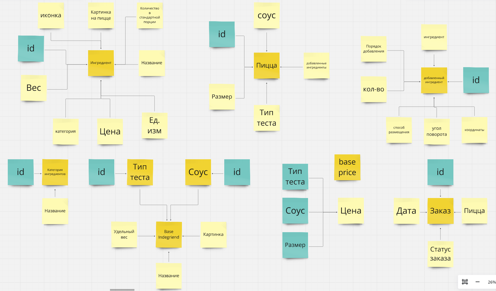
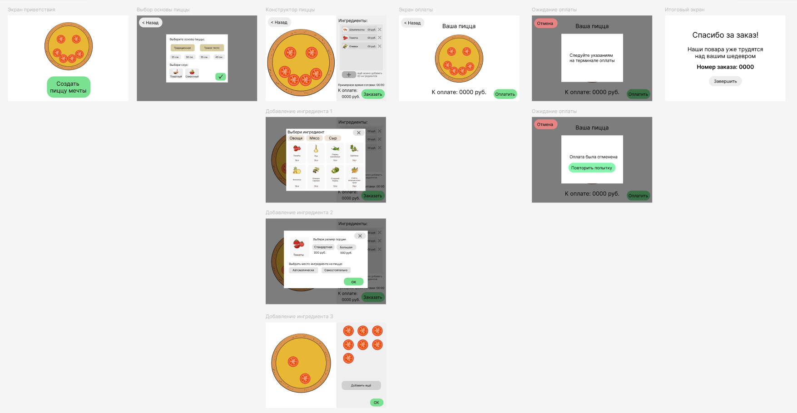

# Конструктор пиццы

Учебный проект яндекс лицей PyQt

### Общее описание

Приложение для терминала самообслуживания в пиццерии. Позволяет сделать заказ пиццы по индивидуальному заказу.

### ТЗ

* [Интерфейс пользователя (figma)](https://www.figma.com/design/GnL1HHSoZgVWraLhC70lMX/pizza_designer?node-id=0-1&t=3cG2pVHnpJpBUBtz-1)
* [Техническое задание (docs/tz_terminal.md)](docs/tz_terminal.md)

### Процесс создания пиццы

Пользователю предлагается создать пиццу, для этого он сначала выбирает размер, основу и соус. Потом открывается редактор пиццы. Есть возможность добавлять ингредиенты. У каждого ингредиента можно выбрать размер порции и по желанию разместить его на пицце самостоятельно. После завершения создания пиццы нужно будет оплатить заказ. После чего статус заказа изменится и его смогут увидеть повара на кухне. 

Изображение пиццы экспортируется в папку images/pizzas

### Классы 
определяются в файле [model.py](model.py)

### Экраны

[экраны](docs/screens.png)

### Скрины готовых пиц

[экраны](docs/screens.png)

### Технологии и библиотеки

* Python 3.11
* PyQt6
* SQLite

